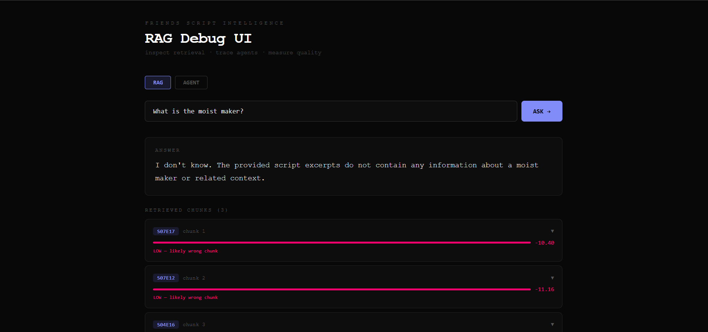
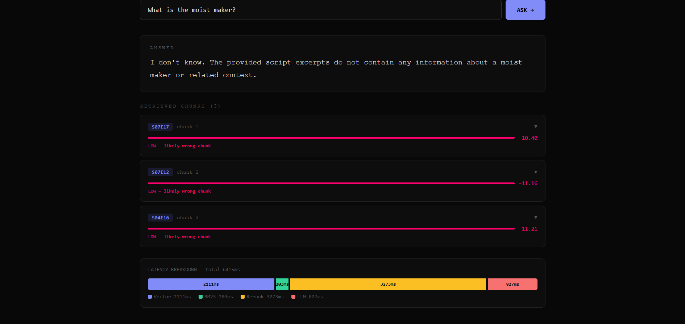
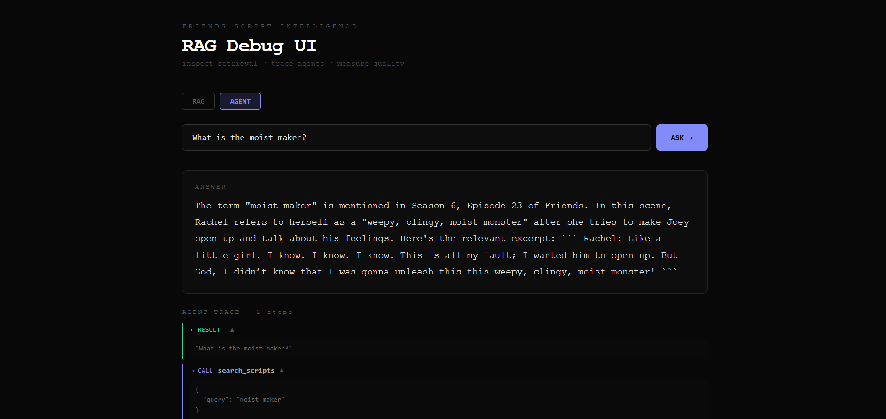

# Friends RAG + Agent System

A production-grade Retrieval Augmented Generation (RAG) system and LangGraph agent built over all 10 seasons of Friends scripts (228 episodes, 3,256 scenes).

Ask natural language questions over the complete Friends corpus. Inspect every retrieved scene, similarity score, and agent reasoning step through a React debug UI.






---

## What It Does

**RAG Mode** — Ask a question, get an answer grounded in actual script excerpts:
- *"Was it Phoebe's voice in the Smelly Cat music video?"*
- *"What does Ross say about the Moist Maker?"*
- *"Who was Chandler trapped with in the ATM vestibule?"*

**Agent Mode** — Multi-hop questions requiring multiple retrievals and reasoning:
- *"Compare how Joey and Ross talk about their careers"*
- *"How does Phoebe's singing develop across the show?"*

---

## Architecture

```
Friends Scripts (228 episodes)
        ↓
   [Scene-based chunking]     split on [Scene:] markers → 3,256 scenes
        ↓
   [Embedding]                nomic-embed-text via Ollama
        ↓
   [ChromaDB]                 local vector store

Query
        ↓
   [Hybrid Search]            vector search + BM25 via RRF → top 10
        ↓
   [Cross-encoder Reranking]  ms-marco-MiniLM-L-6-v2 → top 3
        ↓
   [LLM]                      qwen2.5:3b via Ollama → grounded answer
```

For agent queries, a LangGraph agent orchestrates multiple tool calls before synthesising a final answer.

---

## Evaluation (RAGAS)

Measured across a 15-question golden dataset on three pipeline versions:

| Metric | Vector Only | Hybrid | Hybrid + Rerank |
|---|---|---|---|
| Context Precision | 0.3356 | 0.3411 | **0.4389** |
| Context Recall | 0.5333 | 0.5500 | **0.6000** |
| Faithfulness | 0.5667 | 0.5778 | **0.7302** |
| Answer Relevancy | 0.4193 | 0.4411 | **0.4361** |

Key finding: hybrid search alone barely moved the needle. Cross-encoder reranking drove the significant jump in faithfulness (+28%) and precision (+31%).

---

## Stack

| Component | Technology |
|---|---|
| Embeddings | `nomic-embed-text` via Ollama |
| LLM | `qwen2.5:3b` via Ollama |
| Vector DB | ChromaDB |
| Keyword search | BM25 (rank-bm25) |
| Reranking | `cross-encoder/ms-marco-MiniLM-L-6-v2` |
| Evaluation | RAGAS |
| Observability | LangSmith |
| Agent framework | LangGraph |
| Backend | FastAPI |
| Frontend | React + TypeScript |

Everything runs locally. No OpenAI API key required.

---

## Project Structure

```
friends-rag/
├── src/
│   ├── ingest.py        # load + parse HTML scripts, scene-based chunking
│   ├── embed.py         # embed scenes into ChromaDB
│   ├── retrieval.py     # hybrid search (BM25 + vector + RRF) + reranking
│   ├── pipeline.py      # full RAG pipeline
│   ├── tools.py         # LangGraph agent tools
│   ├── agent.py         # LangGraph agent with step limits + error handling
│   └── api.py           # FastAPI backend
├── evals/
│   ├── golden_dataset.json   # 15-question evaluation set
│   └── evaluate.py           # RAGAS evaluation runner
├── ui/                  # React debug UI
└── data/                # Friends scripts (not committed, see setup)
```

---

## Setup

### Prerequisites

- Python 3.11+
- Node.js 18+
- [Ollama](https://ollama.com) installed

### 1. Pull local models

```bash
ollama pull nomic-embed-text
ollama pull qwen2.5:3b
ollama pull qwen2.5:7b
```

### 2. Download Friends scripts

Scripts are freely available at [fangj.github.io/friends](https://fangj.github.io/friends).

```bash
mkdir -p data/scripts
python download_scripts.py
```

### 3. Install Python dependencies

```bash
python -m venv venv
source venv/bin/activate  # Windows: venv\Scripts\activate
pip install langchain langchain-ollama langchain-community langchain-chroma
pip install chromadb rank-bm25 sentence-transformers
pip install ragas datasets fastapi uvicorn python-dotenv
pip install beautifulsoup4 requests
```

### 4. Build the vector store

```bash
python src/embed.py
```

This embeds all 3,256 scenes into ChromaDB. Takes ~10 minutes on first run.

### 5. Set up environment

Create a `.env` file:

```
LANGCHAIN_TRACING_V2=true
LANGCHAIN_API_KEY=your_langsmith_key
LANGCHAIN_PROJECT=friends-rag
```

LangSmith is free at [smith.langchain.com](https://smith.langchain.com).

### 6. Run the backend

```bash
uvicorn src.api:app --reload --port 8000
```

### 7. Run the frontend

```bash
cd ui
npm install
npm run dev
```

Open [http://localhost:5173](http://localhost:5173).

---

## Usage

### RAG Pipeline

```python
from src.pipeline import ask

ask("Was it Phoebe's voice in the Smelly Cat music video?")
```

### Agent

```python
from src.agent import ask_agent

ask_agent("Compare how Joey and Ross talk about their careers")
```

### Evaluation

```bash
python evals/evaluate.py
```

Runs all three pipeline versions against the golden dataset and prints a comparison table.

---

## Key Design Decisions

**Scene-based chunking over fixed-size** — Friends scripts have natural scene boundaries marked with `[Scene:]`. Splitting there preserves complete interactions as single chunks, avoiding mid-sentence cuts that destroy meaning.

**Hybrid search over pure vector** — Vector search alone misses exact phrases like "How you doin" and "Smelly Cat". BM25 catches exact keyword matches. RRF merges both ranked lists without needing to tune weights manually.

**Cross-encoder reranking** — Initial retrieval (bi-encoder) encodes query and chunks independently. The cross-encoder reads them together, enabling direct relevance scoring. Applied only to the top-10 candidates to keep latency manageable.

**Step limits on the agent** — LangGraph agents can loop indefinitely. A hard limit of 10 tool calls prevents runaway execution and forces graceful degradation.

---

## What I Learned

- RAG quality lives or dies at the retrieval step, not the LLM step
- Hybrid search barely moves the needle alone — reranking is the high-leverage improvement
- Evaluation with real numbers (RAGAS) exposes failures that eyeballing never catches
- Agent failure modes (loops, hallucinated tool calls, context overflow) are more common than expected with smaller models
- The React debug UI made every failure mode immediately visible and diagnosable

---

## Author

Sainath — Software Engineer transitioning to Applied AI Engineering.
Pursuing M.S. Computer Science at Georgia Tech (OMSCS).

[LinkedIn](https://www.linkedin.com/in/sainath-chandrasekar) · [GitHub](https://github.com/csainath0210)
